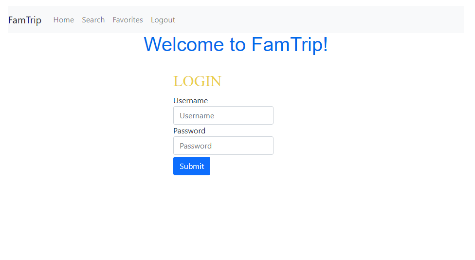

# FamTrip

Have you ever carried a screaming child out of a nice restaurant wondering where it all went wrong? FamTrip is here to help you!

Here at FamTrip we scour the internet looking for family friendly restaurants and activities for your next family trip. With the help of the Yelp Fusion API, here at FamTrip we find the best rated activities and restaurants that we know your family will love. Just register as a user, login, and begin your search. You will be given an option to save your favorites and look at reviews on Yelp with a direct URL link for that business. Next time you log in, you will see your favorites there.



**CONTENTS**

- [Tech Stack](#tech-stack)
- [Features](#features)
- [Future Features](#future-features)
- [Installation](#installation)
- [About the Developer](#about-the-developer)

## Tech Stack

**Backend:** Java 7, Spring Boot, Thymeleaf\
**Frontend:** JavaScript, HTML5, CSS3, Bootstrap\
**Database:** PostgreSQL\
**API:** Yelp Fusion API

## Features

### SAVED FAVORITES

Users can login and see their previous saved favorites.

### MULTIPLE TRIPS

A user can log in and fill out the form for as many trips as they'd like. 

### DIRECT LINK TO YELP

When a user searches for a new trip, they can click on a link in the results page and be sent to the Yelp page with more information and reviews.


## Future Features

- Allowing user to delete or archive past favorites or trips
- Emailing favorites to user
- UI/UX improvements

## Installation

#### Requirements:

- Java 7.0
- Spring Boot

To have this app running on your local computer, please follow the below steps:

Clone repository:

```
$ git clone https://github.com/jessicalynn1/FamTrip.git
```

Create new backend server:

Create a free database server with AWS


Update application properties file:

Get URI from AWS


Run the file in IntelliJ (or your IDE of choice)


Navigate to `localhost:8080/register.html` to plan your next trip!


## About the Developer

Jessica Faylor is a software engineer in California, and previously worked in various fields, including finance, accounting and administration. A combination of her love for family time, learning new things, and less screaming children, led to the creation of FamTrip, her capstone project for Walmart's Java Fellowship program.

Let's connect!

<p><a href="https://www.linkedin.com/in/jessica-faylor-0377b35/">
  
</a>
</p>
